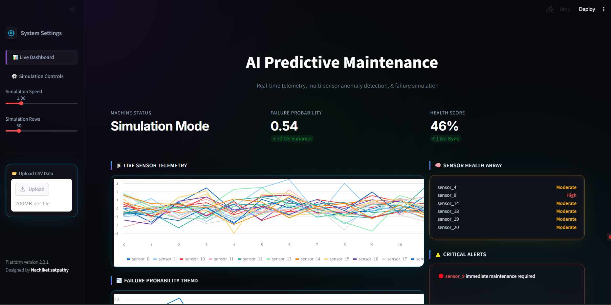
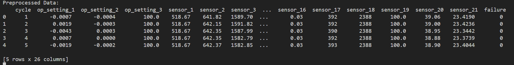
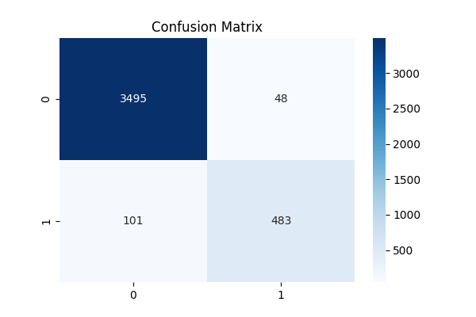
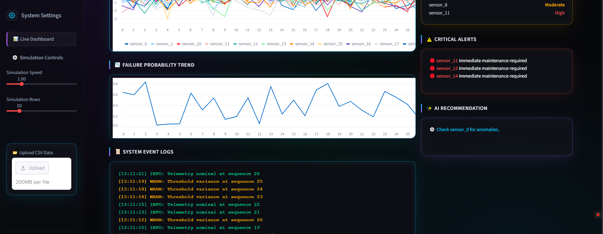

# 🚀 AI Predictive Maintenance System

## 📌 Overview
This project simulates an industrial predictive maintenance system using machine learning and IoT sensor data.

It predicts machine failure and provides real-time monitoring via a Streamlit dashboard.

---

## ❗ Problem Statement
Industries face unexpected machine failures leading to downtime and cost.

This project predicts failures before they occur.

---

## 🏭 Industry Relevance
- Manufacturing
- Automotive
- Energy systems
- Aviation

---

## ⚙️ Tech Stack
- Python
- Pandas, NumPy
- Scikit-learn
- Streamlit
- Matplotlib, Seaborn

---

## 📊 Dataset
NASA CMAPSS turbofan engine dataset.

---

## 🏗️ Architecture
DATA → PREPROCESS → MODEL → PREDICTION → DASHBOARD

---

## 🔧 Installation

```bash
pip install -r requirements.txt

**▶️ Usage**
python main.py
streamlit run app/app.py

**📈 Results**
Accuracy: ~96%
Strong failure detection capability

**📸 Screenshots**


🎯 **Learning Outcomes**
Time-series ML
Feature engineering
Model evaluation
Dashboard development
Industrial AI concepts

## Day 1 — Setup
- Repo created  
- Folder structure  

Commit:
```text
Initial project setup

Day 2 — Dataset
NASA dataset added

Commit:

Added dataset and loading module

Day 3 — Preprocessing
Cleaning + labeling

Commit:

Implemented preprocessing and labeling

Day 4 — Model
Training model

Commit:

Trained Random Forest model

Day 5 — Evaluation
Metrics + confusion matrix

Commit:

Added evaluation metrics and plots

Day 6 — Visualization
Streamlit dashboard

Commit:

Built dashboard UI with real-time simulation

Day 7 — Final Upload
README + images

Commit:
Final project upload with documentation

PROOF CHECKLIST

1. Dataset Preview


2. Preprocessing Output


3. Confusion Matrix
 

5. Failure Trend Graph


6. Dashboard UI

